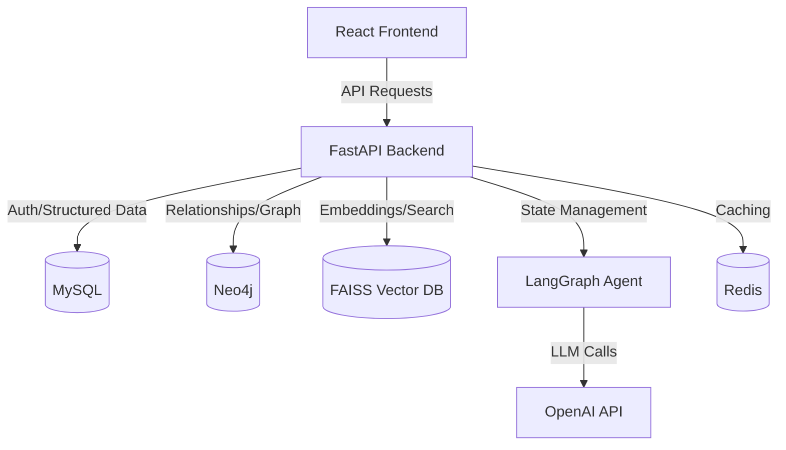

# Comprehensive Project Documentation: AI-Powered Learning Management System (LMS)

This document provides a holistic overview of the platform, covering technical architecture, non-technical objectives, user workflows, and the roles of different stakeholders.

---

## 1. Project Vision & Objectives (Non-Technical)
The primary goal of this platform is to **modernize the educational experience** by integrating agentic AI into the core of the Learning Management System (LMS). Unlike traditional platforms that just host content, this system:
- **Personalizes Learning**: Adapts the curriculum based on the student's existing knowledge and goals.
- **Provides Instant Support**: An AI Tutor is available 24/7 to explain complex topics.
- **Gamifies Progress**: Uses streaks, skill radars, and interactive elements to maintain engagement.
- **Empowers Educators**: Automates administrative tasks and content generation, allowing teachers to focus on student mentorship.

---

## 2. User Roles & Permissions

### 👩‍🎓 Student
- **Self-Directed Learning**: Can start "Personalized Courses" on any topic.
- **Engagement**: Participates in interactive onboarding with the AI to set learning goals.
- **Tools**: Accesses Mindmaps, Flashcards, and an Integrated Code Compiler.
- **Assessment**: Takes AI-generated quizzes at the end of each topic to validate learning.
- **Progress Tracking**: Views their competency radar and learning streaks.

### 👨‍🏫 Teacher
- **Content Management**: Organizes the curriculum into Subjects, Chapters, and Topics.
- **Resource Hub**: Uploads PDFs, links, and other materials that the AI uses for RAG (Retrieval-Augmented Generation).
- **Monitoring**: Oversees student progress and activity within their subjects.

### 🔑 Administrator
- **Governance**: Manages user accounts and roles.
- **System Maintenance**: Monitors platform health and configurations.
- **Global Settings**: Defines default parameters for the AI and system integrations.

---

## 3. Technical Technology Stack

### Backend (Python/FastAPI)
- **FastAPI**: The asynchronous core of the API, ensuring high performance and type safety.
- **LangChain & LangGraph**: The "Brain" of the system. Used to build agentic workflows for personalized course generation with human-in-the-loop checkpoints.
- **SQLAlchemy (MySQL)**: Handles relational data like user profiles, quiz scores, notes, and activity logs.
- **Neo4j (Graph Database)**: Stores complex relationships between users, chat sessions, messages, and topics. This allows for efficient pathfinding and relationship analysis.
- **Redis**: Used for high-speed caching and session management.
- **FAISS (Vector Database)**: Powers semantic search and RAG by storing embeddings of educational resources.
- **JWT (JSON Web Tokens)**: Secure authentication and RBAC (Role-Based Access Control).

### Frontend (React/Vite)
- **React 19**: Utilizing the latest React features for a dynamic and responsive UI.
- **Vite**: The build tool ensuring near-instantaneous development and optimized production bundles.
- **Vanilla CSS (Premium UI)**: A custom design system focusing on:
  - **Glassmorphism**: Translucent, blurred backgrounds for a modern feel.
  - **Micro-animations**: Subtle transitions for hover states and loading.
  - **Responsive Layout**: Seamless experience across mobile and desktop.
- **Axios**: Manages asynchronous requests to the FastAPI backend.

---

## 4. Key Workflows

### A. Personalized Course Generation (The Agentic Workflow)
1. **Initiation**: Student enters a topic (e.g., "Quantum Computing").
2. **Onboarding**: The AI Agent (via LangGraph) asks 3-4 questions to gauge the student's level and specific interests.
3. **Syllabus Drafting**: The AI generates a multi-unit, multi-topic curriculum.
4. **Human Review**: The student reviews the syllabus and can ask for revisions (e.g., "Make it more math-focused").
5. **Formalization**: Once approved, the syllabus is stored in Neo4j as a structured graph of chapters and topics.
6. **On-Demand Content**: As the student clicks a topic, the AI generates the lesson content and a corresponding quiz in real-time.

### B. AI Chat & RAG (Retrieval-Augmented Generation)
1. **Query**: Student asks a question in the chat.
2. **Retrieval**: The system searches the FAISS vector store for relevant excerpts from uploaded resources.
3. **Augmentation**: The AI Tutor combines the student's query with the retrieved context and their personal learning state.
4. **Response**: Provides a grounded, accurate answer that is linked to the curriculum.

### C. Evaluation & Feedback Loop
1. **Quiz Interaction**: Students take interactive quizzes with immediate feedback.
2. **Activity Tracking**: Scores are saved in MySQL and also updated in Neo4j to influence the "Competency Radar."
3. **Adaptive Pathing**: Future lesson content may be adjusted based on previous quiz performance.

---

## 5. Project Architecture Diagram

---

## 6. Deployment & Infrastructure
- **Docker**: The entire system is containerized using `docker-compose`, separating the backend, frontend, MySQL, and Neo4j services.
- **Environment Management**: Utilizes `.env` files for secure configuration of API keys (OpenAI, Neo4j) and database credentials.

---

## 7. Future Scope
- **Voice-to-Text**: Allowing students to interact with the AI tutor via voice.
- **Peer Learning**: Collaborative features where students can share mindmaps and notes.
- **Advanced Analytics**: Predictive modeling to identify students at risk of dropping out.
